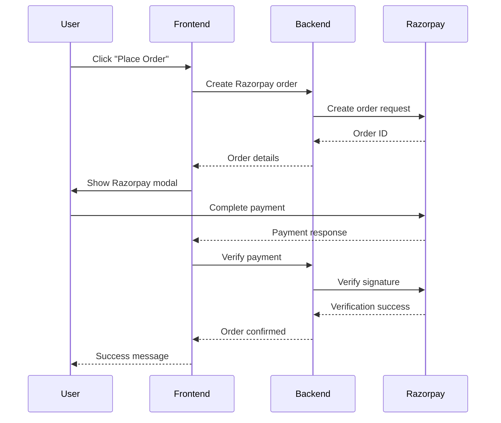

<div align="center">

# 🛍️ Vastra - E-Commerce Platform

[](https://opensource.org/licenses/MIT)
[](https://nodejs.org/)
[](https://reactjs.org/)
[](https://www.mongodb.com/)
[](https://expressjs.com/)

**A modern, full-stack e-commerce solution for fashion retail**

[Live Demo](https://vastra-cloth-shop-frontend.onrender.com) • [Admin Panel](https://vastra-cloth-shop-admin.onrender.com) • [Report Bug](https://github.com/Sarth00718/Vastra-cloth-shop/issues)

</div>

---

## 🌟 Overview

**Vastra** is a production-ready MERN stack e-commerce platform designed specifically for clothing stores. It features a complete shopping experience with user authentication, product management, shopping cart, checkout with Razorpay payment integration, and a comprehensive admin dashboard.

### 🎯 Why Vastra?

✨ **Complete E-Commerce Solution** - From product browsing to payment processing  
🔐 **Secure Transactions** - Razorpay integration for safe payments  
📱 **Mobile-First Design** - Fully responsive on all devices  
🎨 **Modern UI/UX** - Clean, intuitive interface for seamless shopping  
⚡ **Fast & Scalable** - Optimized performance with cloud storage  
🛡️ **Admin Dashboard** - Comprehensive tools for store management

---

## 🌐 Live Deployment

| Service            | URL                                                                                        | Purpose                     |
| ------------------ | ------------------------------------------------------------------------------------------ | --------------------------- |
| 🛍️ **Frontend**    | [vastra-cloth-shop-frontend.onrender.com](https://vastra-cloth-shop-frontend.onrender.com) | Customer shopping interface |
| 🔧 **Backend API** | [vastra-cloth-shop-backend.onrender.com](https://vastra-cloth-shop-backend.onrender.com)   | RESTful API server          |
| 👨‍💼 **Admin Panel** | [vastra-cloth-shop-admin.onrender.com](https://vastra-cloth-shop-admin.onrender.com)       | Store management dashboard  |

---

## 🎥 Features Overview

### 🛍️ Customer Features

#### 🔐 Authentication & Security

- ✅ User registration with email validation
- ✅ Secure login with JWT tokens
- ✅ Google OAuth integration via Firebase
- ✅ Password encryption with bcrypt
- ✅ Persistent sessions

#### 🛒 Shopping Experience

- ✅ Browse products by category (Men, Women, Kids, Accessories)
- ✅ Advanced product filtering and search
- ✅ Detailed product pages with multiple images
- ✅ Image zoom functionality
- ✅ Size and color selection
- ✅ Add to cart with quantity control
- ✅ Save items to wishlist
- ✅ Real-time inventory updates

#### 💳 Checkout & Payments

- ✅ Secure checkout process
- ✅ Razorpay payment gateway integration
- ✅ Multiple payment options (UPI, Cards, Net Banking)
- ✅ Order confirmation emails
- ✅ Invoice generation

#### 📦 Order Management

- ✅ View order history
- ✅ Track order status
- ✅ Download invoices
- ✅ Order cancellation (before shipping)
- ✅ Return/refund requests

### 👨‍💼 Admin Features

#### 🎯 Dashboard

- ✅ Sales analytics and revenue charts
- ✅ Order statistics
- ✅ Customer insights
- ✅ Inventory overview
- ✅ Low stock alerts

#### 📦 Product Management

- ✅ Add/Edit/Delete products
- ✅ Bulk product upload
- ✅ Multiple image upload to Cloudinary
- ✅ Category management
- ✅ Inventory tracking
- ✅ Product variants (size, color)

#### 🛍️ Order Management

- ✅ View all orders
- ✅ Update order status
- ✅ Process refunds
- ✅ Generate reports
- ✅ Customer communication

#### 👥 User Management

- ✅ View customer list
- ✅ User activity tracking
- ✅ Role management

---

## 🛠️ Tech Stack

<table>
<tr>
<td valign="top" width="33%">

### 🎨 Frontend
<<<<<<< HEAD

=======
>>>>>>> cf42078d164cb25622678a1455332db38d54cd7a
- ⚛️ **React 18** - UI library
- 🎨 **Tailwind CSS** - Styling
- 📦 **Context API** - State management
- 🔥 **Firebase** - Google Auth
- 🚀 **Vite** - Build tool
- 📱 **React Router** - Navigation
- 🖼️ **React Image Gallery** - Product images

</td>
<td valign="top" width="33%">

### ⚙️ Backend
<<<<<<< HEAD

=======
>>>>>>> cf42078d164cb25622678a1455332db38d54cd7a
- 🟢 **Node.js** - Runtime
- 🚂 **Express.js** - Web framework
- 🍃 **MongoDB** - Database
- 🔗 **Mongoose** - ODM
- 🔐 **JWT** - Authentication
- 🔒 **bcrypt** - Encryption
- 💳 **Razorpay** - Payments
- 📧 **Nodemailer** - Email service

</td>
<td valign="top" width="33%">

### ☁️ Cloud Services
<<<<<<< HEAD

=======
>>>>>>> cf42078d164cb25622678a1455332db38d54cd7a
- 🖼️ **Cloudinary** - Image storage
- 🌐 **Render** - Deployment
- 🍃 **MongoDB Atlas** - Database hosting
- 🔥 **Firebase** - Authentication
- 📧 **SendGrid** - Email delivery

</td>
</tr>
</table>

---

## 📂 Project Architecture

```
vastra-cloth-shop/
│
├── backend/                     # Express.js API Server
│   ├── config/                  # Configuration files
│   │   ├── cloudinary.js        # Cloudinary setup
│   │   ├── database.js          # MongoDB connection
│   │   └── razorpay.js          # Payment gateway config
│   │
│   ├── controllers/             # Business logic
│   │   ├── authController.js    # Authentication handlers
│   │   ├── productController.js # Product CRUD operations
│   │   ├── cartController.js    # Cart management
│   │   ├── orderController.js   # Order processing
│   │   └── userController.js    # User management
│   │
│   ├── middlewares/             # Custom middleware
│   │   ├── authMiddleware.js    # JWT verification
│   │   ├── adminMiddleware.js   # Admin authorization
│   │   ├── errorHandler.js      # Global error handling
│   │   └── multer.js            # File upload handling
│   │
│   ├── models/                  # Mongoose schemas
│   │   ├── User.js              # User model
│   │   ├── Product.js           # Product model
│   │   ├── Order.js             # Order model
│   │   └── Cart.js              # Cart model
│   │
│   ├── routes/                  # API routes
│   │   ├── auth.js              # Auth routes
│   │   ├── products.js          # Product routes
│   │   ├── cart.js              # Cart routes
│   │   ├── orders.js            # Order routes
│   │   └── admin.js             # Admin routes
│   │
│   ├── utils/                   # Helper functions
│   │   ├── emailTemplates.js    # Email HTML templates
│   │   └── validators.js        # Input validation
│   │
│   ├── .env                     # Environment variables
│   ├── index.js                 # Server entry point
│   └── package.json
│
├── frontend/                    # React Customer App
│   ├── public/                  # Static assets
│   ├── src/
│   │   ├── assets/              # Images, fonts
│   │   ├── components/          # Reusable components
│   │   │   ├── Navbar.jsx
│   │   │   ├── ProductCard.jsx
│   │   │   ├── CartItem.jsx
│   │   │   └── Footer.jsx
│   │   │
│   │   ├── pages/               # Page components
│   │   │   ├── Home.jsx
│   │   │   ├── Products.jsx
│   │   │   ├── ProductDetail.jsx
│   │   │   ├── Cart.jsx
│   │   │   ├── Checkout.jsx
│   │   │   ├── Orders.jsx
│   │   │   ├── Login.jsx
│   │   │   └── Register.jsx
│   │   │
│   │   ├── context/             # Context API
│   │   │   ├── AuthContext.jsx
│   │   │   └── CartContext.jsx
│   │   │
│   │   ├── utils/               # Utility functions
│   │   │   ├── api.js           # Axios configuration
│   │   │   └── helpers.js
│   │   │
│   │   ├── App.jsx              # Root component
│   │   └── main.jsx             # Entry point
│   │
│   ├── .env                     # Environment variables
│   └── package.json
│
├── admin/                       # React Admin Dashboard
│   ├── src/
│   │   ├── components/          # Admin components
│   │   │   ├── Sidebar.jsx
│   │   │   ├── Dashboard.jsx
│   │   │   ├── ProductList.jsx
│   │   │   ├── AddProduct.jsx
│   │   │   └── OrderList.jsx
│   │   │
│   │   ├── pages/               # Admin pages
│   │   ├── context/             # Admin context
│   │   ├── App.jsx
│   │   └── main.jsx
│   │
│   └── package.json
│
└── README.md
```

---

## 🚀 Getting Started

### ⚠️ Important: Database Setup

**Before running the application, you need to set up the database with clothing products:**

```bash
cd backend
npm install
npm run reseed
```

This will:
- ✅ Clean all existing products from MongoDB
- ✅ Remove all images from Cloudinary
- ✅ Add 28 clothing products (Men, Women, Kids)
- ✅ Upload product images to Cloudinary

**Available Database Commands:**
```bash
npm run cleanup  # Only cleanup database and Cloudinary
npm run seed     # Only add products (without cleanup)
npm run reseed   # Complete reset (cleanup + seed)
npm run verify   # View product distribution and stats
```

For detailed database management, see [`backend/DATABASE_MANAGEMENT.md`](backend/DATABASE_MANAGEMENT.md)

---

### 📋 Prerequisites

- **Node.js** v16+ - [Download](https://nodejs.org/)
- **MongoDB Atlas Account** - [Sign Up](https://www.mongodb.com/cloud/atlas)
- **Cloudinary Account** - [Sign Up](https://cloudinary.com/)
- **Razorpay Account** - [Sign Up](https://razorpay.com/)
- **Firebase Project** - [Console](https://console.firebase.google.com/)

### 📦 Installation

#### 1️⃣ Clone the Repository

```bash
git clone https://github.com/Sarth00718/Vastra-cloth-shop.git
cd Vastra-cloth-shop
```

#### 2️⃣ Backend Setup

```bash
cd backend
npm install
```

Create `.env` file in `backend/` directory:

```env
# Server Configuration
PORT=5000
NODE_ENV=development

# Database
MONGO_URI=mongodb+srv://<username>:<password>@cluster0.mongodb.net/vastra?retryWrites=true&w=majority

# JWT Secret
JWT_SECRET=your_super_secret_jwt_key_change_in_production
JWT_EXPIRE=30d

# Cloudinary Configuration
CLOUD_NAME=your_cloudinary_cloud_name
CLOUD_API_KEY=your_cloudinary_api_key
CLOUD_API_SECRET=your_cloudinary_api_secret

# Razorpay Configuration
RAZORPAY_KEY_ID=your_razorpay_key_id
RAZORPAY_KEY_SECRET=your_razorpay_key_secret

# Email Configuration (Optional)
SMTP_HOST=smtp.gmail.com
SMTP_PORT=587
SMTP_USER=your_email@gmail.com
SMTP_PASSWORD=your_app_specific_password

# Frontend URLs (for CORS)
FRONTEND_URL=http://localhost:5173
ADMIN_URL=http://localhost:5174
```

Start the backend server:

```bash
npm start
# or for development with auto-reload
npm run dev
```

Backend will run on `http://localhost:5000`

#### 3️⃣ Frontend Setup

Open a **new terminal**:

```bash
cd frontend
npm install
```

Create `.env` file in `frontend/` directory:

```env
VITE_API_URL=http://localhost:5000
VITE_RAZORPAY_KEY_ID=your_razorpay_key_id

# Firebase Configuration
VITE_FIREBASE_API_KEY=your_firebase_api_key
VITE_FIREBASE_AUTH_DOMAIN=your-project.firebaseapp.com
VITE_FIREBASE_PROJECT_ID=your_project_id
VITE_FIREBASE_STORAGE_BUCKET=your-project.appspot.com
VITE_FIREBASE_MESSAGING_SENDER_ID=your_sender_id
VITE_FIREBASE_APP_ID=your_app_id
```

Start the frontend:

```bash
npm run dev
```

Frontend will run on `http://localhost:5173`

#### 4️⃣ Admin Panel Setup

Open **another terminal**:

```bash
cd admin
npm install
```

Create `.env` file in `admin/` directory:

```env
VITE_API_URL=http://localhost:5000
```

Start the admin panel:

```bash
npm run dev
```

Admin panel will run on `http://localhost:5174`

---

## 🔌 API Documentation

### Authentication Endpoints

```http
POST   /api/auth/register           # Register new user
POST   /api/auth/login              # User login
POST   /api/auth/google             # Google OAuth login
GET    /api/auth/me                 # Get current user (protected)
POST   /api/auth/logout             # User logout
POST   /api/auth/forgot-password    # Request password reset
POST   /api/auth/reset-password     # Reset password
```

### Product Endpoints

```http
GET    /api/products                # Get all products
GET    /api/products/:id            # Get product by ID
GET    /api/products/category/:cat  # Get products by category
POST   /api/products                # Create product (admin)
PUT    /api/products/:id            # Update product (admin)
DELETE /api/products/:id            # Delete product (admin)
GET    /api/products/search?q=      # Search products
```

### Cart Endpoints

```http
GET    /api/cart                    # Get user's cart (protected)
POST   /api/cart                    # Add item to cart (protected)
PUT    /api/cart/:itemId            # Update cart item quantity (protected)
DELETE /api/cart/:itemId            # Remove item from cart (protected)
DELETE /api/cart                    # Clear cart (protected)
```

### Order Endpoints

```http
GET    /api/orders                  # Get user's orders (protected)
GET    /api/orders/:id              # Get order by ID (protected)
POST   /api/orders                  # Create order (protected)
PUT    /api/orders/:id/status       # Update order status (admin)
POST   /api/orders/:id/cancel       # Cancel order (protected)
GET    /api/orders/admin/all        # Get all orders (admin)
```

### Payment Endpoints

```http
POST   /api/payment/create-order    # Create Razorpay order (protected)
POST   /api/payment/verify          # Verify payment (protected)
```

---

## 💳 Razorpay Integration

### Setup Instructions

1. **Sign up** at [Razorpay Dashboard](https://dashboard.razorpay.com/)
2. Navigate to **Settings → API Keys**
3. Generate **Key ID** and **Key Secret**
4. Add credentials to your `.env` files
5. Enable **Test Mode** for development

### Payment Flow



---

## 🖼️ Cloudinary Setup

### Image Upload Configuration

1. Create account at [Cloudinary](https://cloudinary.com/)
2. Get your **Cloud Name**, **API Key**, and **API Secret**
3. Add to backend `.env` file
4. Images are automatically optimized and stored in the cloud

### Image Transformation Features

- ✅ Auto-format (WebP, AVIF)
- ✅ Lazy loading
- ✅ Responsive images
- ✅ Quality optimization
- ✅ On-the-fly resizing

---

## 🐛 Troubleshooting

<details>
<summary><b>Payment Gateway Issues</b></summary>

- ✅ Ensure Razorpay keys are correct in both backend and frontend `.env`
- ✅ Check if test mode is enabled for development
- ✅ Verify webhook configuration
- ✅ Clear browser cache and cookies

```bash
# Test Razorpay connection
curl -u your_key_id:your_key_secret https://api.razorpay.com/v1/payments
```

</details>

<details>
<summary><b>Image Upload Failures</b></summary>

- ✅ Verify Cloudinary credentials in `.env`
- ✅ Check file size limits (default 10MB)
- ✅ Ensure multer middleware is configured correctly
- ✅ Check network connectivity

</details>

<details>
<summary><b>MongoDB Connection Errors</b></summary>

- ✅ Whitelist your IP in MongoDB Atlas
- ✅ Check connection string format
- ✅ Verify database user permissions
- ✅ Ensure cluster is not paused

```bash
# Test MongoDB connection
mongosh "your_connection_string"
```

</details>

<details>
<summary><b>CORS Errors</b></summary>

Update CORS configuration in `backend/index.js`:

```javascript
app.use(
  cors({
    origin: [process.env.FRONTEND_URL, process.env.ADMIN_URL],
    credentials: true,
  }),
);
</details>

---

## 🚀 Deployment Guide

### Deploy Backend to Render

1. Push code to GitHub
2. Create new **Web Service** on [Render](https://render.com)
3. Connect GitHub repository
4. Configure:
   - **Build Command**: `npm install`
   - **Start Command**: `npm start`
   - **Environment Variables**: Add all from `.env`
5. Deploy and copy service URL

### Deploy Frontend to Render

1. Create new **Static Site** on Render
2. Configure:
   - **Build Command**: `npm install && npm run build`
   - **Publish Directory**: `dist`
   - **Environment Variables**: Add frontend `.env` vars
3. Deploy

### Deploy Admin Panel

Follow same steps as frontend deployment.

### Update Production URLs

After deployment, update:

- Backend CORS origins with deployed frontend/admin URLs
- Frontend/Admin API URLs to point to deployed backend
- Razorpay webhook URLs

---

## 🎯 Future Roadmap

### Phase 1: Enhanced Features

- [ ] 🌙 Dark mode support
- [ ] 🔍 Advanced product filtering
- [ ] ⭐ Product reviews and ratings
- [ ] 📧 Email notifications
- [ ] 💬 Live chat support
- [ ] 🏷️ Discount codes and coupons

### Phase 2: Advanced Functionality

- [ ] 🌍 Multi-language support
- [ ] 💱 Multi-currency support
- [ ] 📱 Progressive Web App (PWA)
- [ ] 🔔 Push notifications
- [ ] 🎨 Custom product configurator
- [ ] 📊 Advanced analytics dashboard

### Phase 3: Scale & Optimization

- [ ] 🚀 Redis caching
- [ ] 📈 Elasticsearch integration
- [ ] 🤖 AI-powered recommendations
- [ ] 📱 React Native mobile app
- [ ] 🌐 CDN integration
- [ ] ⚡ GraphQL API

---

## 🤝 Contributing

We welcome contributions! Here's how you can help:

1. 🍴 **Fork** the repository
2. 🌱 Create a **feature branch** (`git checkout -b feature/AmazingFeature`)
3. 💾 **Commit** your changes (`git commit -m 'Add AmazingFeature'`)
4. 📤 **Push** to the branch (`git push origin feature/AmazingFeature`)
5. 🎉 Open a **Pull Request**

### Contribution Guidelines

- Follow existing code style and conventions
- Write clear commit messages
- Add tests for new features
- Update documentation as needed
- Ensure all tests pass before submitting PR

---

## 📊 Performance Metrics

- ⚡ **Lighthouse Score**: 95+
- 🚀 **First Contentful Paint**: < 1.5s
- 📱 **Mobile Friendly**: 100%
- ♿ **Accessibility**: 90+
- 🎨 **Best Practices**: 95+

---

## 🔐 Security

### Security Measures Implemented

- ✅ JWT-based authentication
- ✅ Password hashing with bcrypt
- ✅ Input validation and sanitization
- ✅ SQL injection prevention
- ✅ XSS protection
- ✅ CSRF protection
- ✅ Rate limiting
- ✅ Secure headers (Helmet.js)
- ✅ HTTPS enforcement

### Reporting Security Issues

If you discover a security vulnerability, please email **sarthnarola007@gmail.com**. Do not create public GitHub issues for security vulnerabilities.

---

## 👨‍💻 Developer

<table>
<tr>
<td align="center">

<br />
<br />
<sub><b>Sarth Narola</b></sub>
<br />
<sub>Full Stack Developer</sub>
<br />
<br />
<a href="https://github.com/Sarth00718" title="GitHub">

</a>
<a href="https://www.linkedin.com/in/sarth-narola-223002323/" title="LinkedIn">

</a>
<a href="mailto:sarthnarola007@gmail.com" title="Email">

</a>
<br />
<br />
📍 Surat, Gujarat, India
</td>
</tr>
</table>

---

## 📄 License

This project is licensed under the **MIT License** - see the [LICENSE](LICENSE) file for details.

```
MIT License

Copyright (c) 2026 Sarth Narola

Permission is hereby granted, free of charge, to any person obtaining a copy
of this software and associated documentation files (the "Software"), to deal
in the Software without restriction, including without limitation the rights
to use, copy, modify, merge, publish, distribute, sublicense, and/or sell
copies of the Software, and to permit persons to whom the Software is
furnished to do so, subject to the following conditions:

The above copyright notice and this permission notice shall be included in all
copies or substantial portions of the Software.
```

---

## 🙏 Acknowledgments

- [MongoDB University](https://university.mongodb.com/) for database best practices
- [Razorpay Documentation](https://razorpay.com/docs/) for payment integration
- [Cloudinary](https://cloudinary.com/documentation) for image management
- [React Documentation](https://react.dev/) for frontend guidance
- [Express.js](https://expressjs.com/) for backend framework
- Icons by [Heroicons](https://heroicons.com/)

---

## 📞 Support

Need help? Have questions?

- 📧 **Email**: sarthnarola007@gmail.com
- 💬 **GitHub Issues**: [Create an issue](https://github.com/Sarth00718/Vastra-cloth-shop/issues)
- 💼 **LinkedIn**: [Connect with me](https://www.linkedin.com/in/sarth-narola-223002323/)

---

<div align="center">

### ⭐ If this project helped you, please star it on GitHub!

### 🔗 Connect with me on social media

[](https://github.com/Sarth00718)
[](https://www.linkedin.com/in/sarth-narola-223002323/)
[](mailto:sarthnarola007@gmail.com)

---

**Made with ❤️ by [Sarth Narola](https://github.com/Sarth00718)**

[⬆ Back to Top](#-vastra---e-commerce-platform)

</div>
